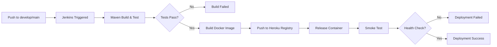

# CI/CD Setup Guide - Week8 Practice1
## Jenkins + Docker + Heroku Container Registry

## 📋 Overview

This project uses **Jenkins + Docker + Heroku Container Registry** for Continuous Integration and Continuous Deployment.

### Deployment Strategy

| Branch   | Environment | Spring Profile | Heroku App            | Docker Image Registry                    |
|----------|-------------|----------------|-----------------------|-----------------------------------------|
| `develop` | Development | `dev`          | `week8-practice1-dev` | `registry.heroku.com/week8-practice1-dev/web` |
| `main`    | Production  | `prod`         | `week8-practice1-prod`| `registry.heroku.com/week8-practice1-prod/web` |

### Deployment Flow

```
┌─────────────┐    ┌─────────────┐    ┌──────────────┐    ┌────────────┐    ┌─────────────┐
│   Git Push  │ → │   Jenkins   │ → │  Build &     │ → │ Push to    │ → │  Release    │
│ (dev/main)  │    │   Pipeline  │    │  Test Docker │    │ Heroku Reg │    │  to Heroku  │
└─────────────┘    └─────────────┘    └──────────────┘    └────────────┘    └─────────────┘
                                            │                    │                  │
                                            v                    v                  v
                                   ┌──────────────┐    ┌────────────┐    ┌─────────────┐
                                   │ Maven Build  │    │ Docker Image│    │  Dynos Run  │
                                   │ Unit Tests   │    │   Push     │    │  Container  │
                                   └──────────────┘    └────────────┘    └─────────────┘
```

---

## 🚀 Prerequisites

### 1. Jenkins Setup

Ensure your Jenkins instance has:
- ✅ Maven 3.9+ installed (Configure in **Manage Jenkins → Global Tool Configuration**)
- ✅ Docker installed on Jenkins agent
- ✅ Git plugin installed
- ✅ Discord Notification plugin (optional, for notifications)

### 2. Required Jenkins Credentials

Create these credentials in **Jenkins → Manage Jenkins → Credentials**:

| Credential ID        | Type    | Description                              |
|----------------------|---------|------------------------------------------|
| `HEROKU_API_KEY`     | Secret  | Your Heroku API Key (same for Container Registry) |
| `db-url`             | Secret  | MySQL Database URL (JDBC format)        |
| `db-username`        | Secret  | Database username                       |
| `db-password`        | Secret  | Database password                       |
| `db-driver`          | Secret  | Database driver (e.g., `com.mysql.cj.jdbc.Driver`) |
| `discord-notification`| Secret | Discord webhook URL (optional)          |

**Note:** Heroku Container Registry uses the same API key as Heroku. No separate Docker Hub credentials needed!

---

## 🔧 Setup Instructions

### Step 1: Create Jenkins Pipeline Job

1. Open Jenkins Dashboard
2. Click **New Item**
3. Enter item name: `week8-practice1-pipeline`
4. Select **Pipeline**
5. Click **OK**

### Step 2: Configure Pipeline

In the job configuration:

**General:**
- Check **This project is parameterized** (optional, for manual builds)

**Pipeline:**
- Definition: **Pipeline script from SCM**
- SCM: **Git**
- Repository URL: `https://github.com/YOUR_USERNAME/week8-practice1.git`
- Credentials: Your GitHub credentials
- Branches to build: `**`
- Script Path: `Jenkinsfile`

### Step 3: Get Heroku API Key

```bash
# Login to Heroku
heroku login

# Get your API key
heroku auth:token
```

Copy the token and add it to Jenkins credentials as `HEROKU_API_KEY`.

**Important:** This same key is used for:
- Heroku API authentication
- Heroku Container Registry login (`registry.heroku.com`)

### Step 4: Create Heroku Apps (Optional)

The pipeline will auto-create apps, but you can create manually:

```bash
# Create dev app
heroku create week8-practice1-dev

# Create prod app
heroku create week8-practice1-prod

# Verify container registry is enabled
heroku container:login --app week8-practice1-dev
```

---

## 📦 Deployment Files

### File Structure

```
Week8_Practice1/
├── Jenkinsfile           # Jenkins pipeline configuration
├── Dockerfile           # Docker image configuration
├── .dockerignore        # Docker build exclusions
├── pom.xml              # Maven build configuration
└── DEPLOYMENT.md        # This file
```

### File Descriptions

| File          | Purpose |
|---------------|---------|
| `Jenkinsfile` | Defines CI/CD pipeline: checkout → build → test → docker build → push → release → smoke test |
| `Dockerfile`  | Multi-stage Docker build for optimized production image |
| `.dockerignore` | Excludes unnecessary files from Docker build context |

---

## 🔄 Pipeline Stages

### 1. Checkout
- Clones the repository
- Extracts Git information (branch, commit, author, message)
- Auto-detects environment based on branch

### 2. Build
- Compiles the application with Maven
- Creates executable JAR file
- Location: `target/Week8_Practice1-0.0.1-SNAPSHOT.jar`

### 3. Test
- Runs unit and integration tests
- **Fails the build if tests fail** ✅
- Publishes test reports

### 4. Security Scan
- Checks dependencies for vulnerabilities
- Uses Maven dependency:tree

### 5. Build Docker Image
- Builds Docker image using `Dockerfile`
- Tags image with:
  - `registry.heroku.com/<app-name>/web:<BUILD_NUMBER>`
  - `registry.heroku.com/<app-name>/web:latest`
- Passes build arguments for metadata

### 6. Push to Heroku Registry
- Logs in to `registry.heroku.com` using Heroku API key
- Pushes Docker image to Heroku Container Registry
- Both versioned and latest tags are pushed

### 7. Deploy to Heroku
- Installs Heroku CLI (if not present)
- Authenticates with Heroku
- Creates app if it doesn't exist
- Sets environment variables:
  - `SPRING_PROFILES_ACTIVE` (dev/prod)
  - `SPRING_DATASOURCE_URL`
  - `SPRING_DATASOURCE_USERNAME`
  - `SPRING_DATASOURCE_PASSWORD`
  - `SPRING_DATASOURCE_DRIVER_CLASS_NAME`
- Releases container: `heroku container:release web`
- **Container restarts automatically** ✅

### 8. Smoke Test
- Waits 60 seconds for app startup
- Health check against `/actuator/health`
- Retries up to 10 times (10s interval)
- **Fails deployment if health check fails**

---

## 🔐 Environment Variables

### Application Profiles

**Development (dev):**
- Internal testing environment
- Uses H2 in-memory database or dev MySQL
- Auto-deploys on push to `develop` branch

**Production (prod):**
- Production-ready environment
- Uses external MySQL database
- Auto-deploys on push to `main` branch

### Database Configuration

Set these in Jenkins credentials:

```yaml
db-url: jdbc:mysql://your-host:3306/week8_db?createDatabaseIfNotExist=true
db-username: your_db_username
db-password: your_db_password
db-driver: com.mysql.cj.jdbc.Driver
```

---

## 🎯 Deployment Workflow

### Automatic Deployment



### Manual Deployment

You can also trigger builds manually from Jenkins:

1. Open the pipeline job
2. Click **Build with Parameters**
3. Select:
   - `DEPLOY_ENV`: `development` or `production`
   - `RUN_TESTS`: `true` or `false`
   - `CUSTOM_DOMAIN`: Optional custom domain
4. Click **Build`

---

## 🐳 Docker Commands Reference

### Build Image Locally

```bash
# Build image
docker build -t week8-practice1:latest .

# Run locally
docker run -p 8080:8080 \
  -e SPRING_PROFILES_ACTIVE=dev \
  -e SPRING_DATASOURCE_URL=jdbc:mysql://localhost:3306/testdb \
  week8-practice1:latest
```

### Heroku Container Registry Commands

```bash
# Login to Heroku Container Registry
heroku container:login

# Pull image from registry
docker pull registry.heroku.com/week8-practice1-dev/web

# Push to registry (alternative to Jenkins)
docker tag week8-practice1:latest registry.heroku.com/week8-practice1-dev/web
docker push registry.heroku.com/week8-practice1-dev/web

# Release to Heroku
heroku container:release web --app week8-practice1-dev
```

---

## 🧪 Testing Locally

### Test Docker Image

```bash
# Build image
docker build -t week8-test:latest .

# Run with test profile
docker run --rm -p 8080:8080 \
  -e SPRING_PROFILES_ACTIVE=test \
  week8-test:latest

# Check health
curl http://localhost:8080/actuator/health
```

### Test Heroku Deployment Manually

```bash
# Set Heroku API key
export HEROKU_API_KEY=your_api_key

# Login to container registry
heroku container:login

# Build and push
docker build -t registry.heroku.com/week8-practice1-dev/web .
docker push registry.heroku.com/week8-practice1-dev/web

# Release
heroku container:release web --app week8-practice1-dev

# Check logs
heroku logs --tail --app week8-practice1-dev
```

---

## 🔍 Troubleshooting

### Common Issues

#### 1. Build Failed - Tests Failed
**Solution:** Fix failing tests locally first:
```bash
mvn clean test
```

#### 2. Docker Build Failed
**Possible Causes:**
- Docker not installed on Jenkins agent
- Insufficient disk space
- Docker daemon not running

**Solution:**
```bash
# Check Docker is running
docker --version
docker ps

# Clean up if needed
docker system prune -a
```

#### 3. Push to Registry Failed
**Possible Causes:**
- Invalid HEROKU_API_KEY
- Network issues
- Registry authentication failed

**Solution:**
```bash
# Test login manually
echo "your_api_key" | docker login --username=_ --password-stdin registry.heroku.com
```

#### 4. Health Check Failed
**Possible Causes:**
- Application not starting (check logs)
- Database connection issues
- Missing environment variables

**Debug Commands:**
```bash
# Check Heroku logs
heroku logs --tail --app week8-practice1-dev

# Check dyno status
heroku ps --app week8-practice1-dev

# Check container status
heroku container:status --app week8-practice1-dev

# Restart
heroku ps:restart --app week8-practice1-dev

# Check config vars
heroku config --app week8-practice1-dev
```

#### 5. Container Release Failed
**Solution:**
```bash
# Check if container was pushed
heroku container:ls --app week8-practice1-dev

# Force release
heroku container:release web --app week8-practice1-dev
```

---

## 📊 Monitoring

### Application Endpoints

After successful deployment:

| Endpoint                | Description                           |
|-------------------------|---------------------------------------|
| `/actuator/health`      | Health check                          |
| `/actuator/info`        | Application information               |
| `/swagger-ui/index.html` | API documentation                    |

### Heroku Commands

```bash
# View logs
heroku logs --tail --app week8-practice1-dev

# Scale dynos
heroku ps:scale web=1 --app week8-practice1-dev

# View metrics
heroku ps --app week8-practice1-dev

# View container info
heroku container:info --app week8-practice1-dev
```

---

## 🎉 Best Practices Implemented

✅ **Docker-based deployment** - Full control over container image
✅ **Multi-stage Dockerfile** - Optimized image size
✅ **Branch-based deployment** - Auto-detect environment from branch
✅ **Test validation** - Build fails if tests fail
✅ **Health checks** - Smoke test after deployment
✅ **Container registry** - Heroku Container Registry (no Docker Hub needed)
✅ **Automatic restart** - Container restarts on deployment
✅ **Security** - Non-root user in Docker, .dockerignore
✅ **Notifications** - Discord integration (optional)
✅ **Idempotent** - Safe to run multiple times
✅ **Clean code** - Well-documented, maintainable pipeline

---

## 🆕 Docker vs Git Deployment

### Why Docker Deployment?

| Aspect | Git Deployment | Docker Deployment |
|--------|---------------|-------------------|
| Build Control | Heroku manages | Full control |
| Image Size | Optimized by Heroku | Optimized by us |
| Build Time | Slower (builds on Heroku) | Faster (cached layers) |
| Debugging | Harder | Can test locally |
| Portability | Heroku-only | Can push to any registry |

### When to Use Each?

**Use Git Deployment if:**
- Simple deployment needed
- Don't need custom Docker configurations
- Want Heroku to manage everything

**Use Docker Deployment if:**
- Need custom base images
- Want to test locally before deploy
- Need optimized multi-stage builds
- Want full control over container

---

## 📝 Additional Notes

### Credentials You Already Have

Based on your Jenkins credentials:
- ✅ `HEROKU_API_KEY` - Ready to use for Container Registry
- ✅ `discord-notification` - For build notifications
- ✅ `docker-hub` / `docker-hub-pat` - Not needed (using Heroku Registry)
- ✅ `deploy-server` - Available if you want to add server deployment later

### What's Needed from You

To proceed with CI/CD setup, please provide:

1. **Database Credentials**:
   - Database URL (JDBC format)
   - Database username
   - Database password
   - Database driver class

2. **Heroku App Names** (optional, can use defaults):
   - Dev app: `week8-practice1-dev` (default)
   - Prod app: `week8-practice1-prod` (default)

3. **Custom Domain** (optional):
   - If you have custom domains for the apps

---

## 📚 Resources

- [Jenkins Pipeline Syntax](https://www.jenkins.io/doc/book/pipeline/syntax/)
- [Heroku Container Registry](https://devcenter.heroku.com/articles/container-registry-and-runtime)
- [Dockerfile Best Practices](https://docs.docker.com/develop/develop-images/dockerfile_best-practices/)
- [Spring Boot Profiles](https://docs.spring.io/spring-boot/docs/current/reference/html/features.html#features.profiles)
- [Spring Boot Actuator](https://docs.spring.io/spring-boot/docs/current/reference/html/actuator.html#actuator)
